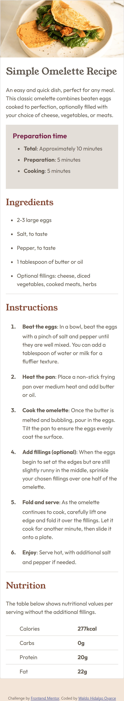

# Frontend Mentor - Mi recipe page solution

### Link

- Live Site URL: [URL del proyecto live](https://waldohidalgo.github.io/proyecto_1_recipe_page_frontendmentor/)

Esta es mi solución al challenge primero de Front End Mentor el cual consiste en realizar una Recipe Page para lo cual he utilizado HTML y CSS junto con bootstrap 5 para algo puntual. El paquete inicial con el cual se comienza el proyecto se encuentra en [Recipe page challenge on Frontend Mentor](https://www.frontendmentor.io/challenges/recipe-page-KiTsR8QQKm) el cual contiene un esqueleto HTML, instrucciones en archivos markdown y los diferentes assets (recursos) necesarios para construir el proyecto.

### Screenshot

Mi proyecto en pantallas grandes lo muestro a continuación:

Mi proyecto en pantallas small se muestra a continuación:

